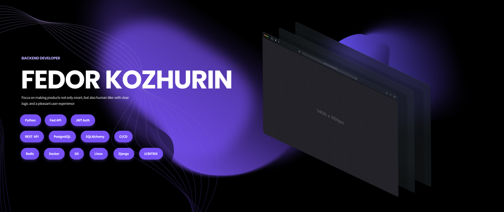

---

<h2>О себе</h2>

- Создаю серверную часть веб-приложений и ботов с фокусом на **чистую архитектуру** и **надежность данных**.
- Специализируюсь на разработке REST API и интеграциях, выстраивая предсказуемую и масштабируемую логику.
- Веду разработку многофункционального Telegram-бота в связке с полноценной CRM системой для молодежной организации.
- Финалист олимпиады по промышленной разработке PROD (кейс «Проектирование архитектуры и реализация API-сервиса на Python»).
- Портфолио - recursivethinker.tech

---

<h2>
   
  Технологический стек
</h2>

### Backend Core

### Базы данных и ORM

### Инфраструктура и инструменты

---

<h2>
   
  Ключевые компетенции
</h2>

<h3>Архитектура</h3>

- Проектирование REST API и webhook-интеграций
- Реляционное моделирование БД (нормализация, индексы, связи)
- Проектирование структуры сервисов и контуров ответственности
- Безопасная миграция схем баз данных без потери консистентности

<h3>Разработка</h3>

- Разработка backend на Python (FastAPI / асинхронность)
- Интеграция и маршрутизация Telegram Bot API (aiogram / Telebot)
- Работа с SQLAlchemy: ORM, raw SQL, управление транзакциями
- Контейнеризация локального окружения с помощью Docker
- Аутентификация и авторизация (JWT, ролевой доступ)

<h3>Процессы</h3>

- Управление версиями через Git и GitHub
- Локальная отладка и тестирование интеграций
- Итеративная разработка от MVP до масштабируемого решения

---

<h2>
   
  Статистика
</h2>

